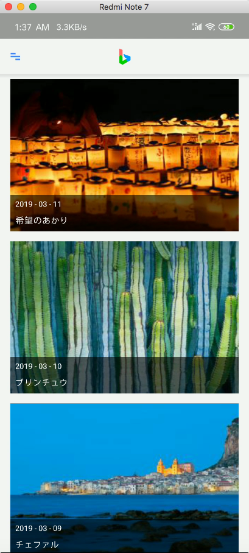
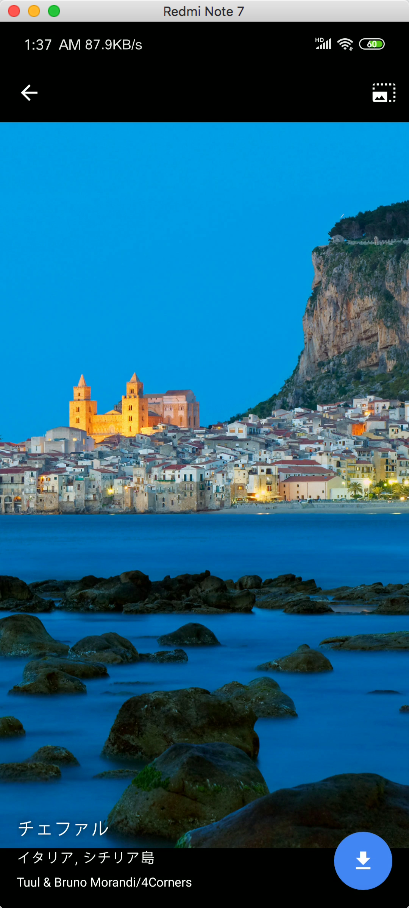
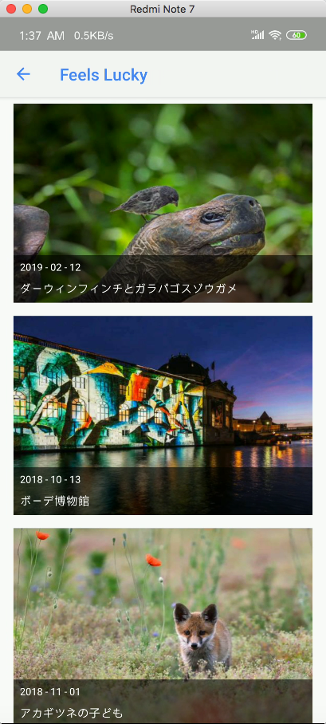
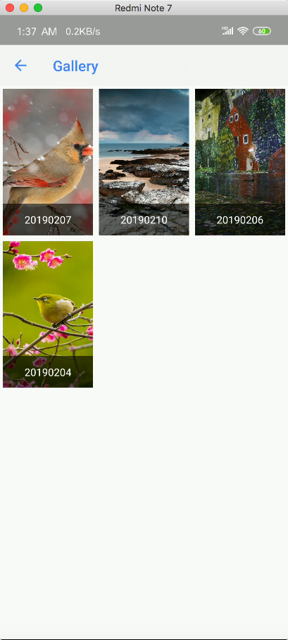
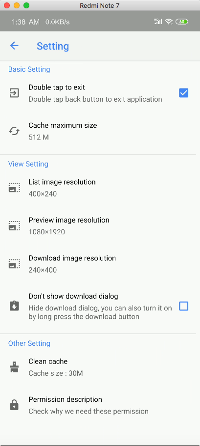
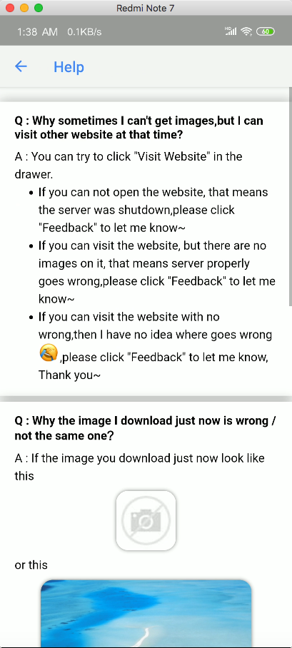

# Bing Image Android

An Android APP for [Bing-Image](https://github.com/CreeperSan/bing-image)

一个获取[必应壁纸](https://github.com/CreeperSan/bing-image)的Android APP

## Quick Start

1. Download latest [release](https://github.com/CreeperSan/bing-image-android/releases) and import it in your Android Studio

   下载最近的[release](https://github.com/CreeperSan/bing-image-android/releases)并在Android Studio中导入工程

2. If you want to use your website, then you can edit it on `app/src/main/java/com/creepersan/bingimage/network/constance.kt`

   如果你想使用你自己的网站，你可以修改这个文件`app/src/main/java/com/creepersan/bingimage/network/constance.kt`

3. Run

   运行

## Screenshot

## License

MIT